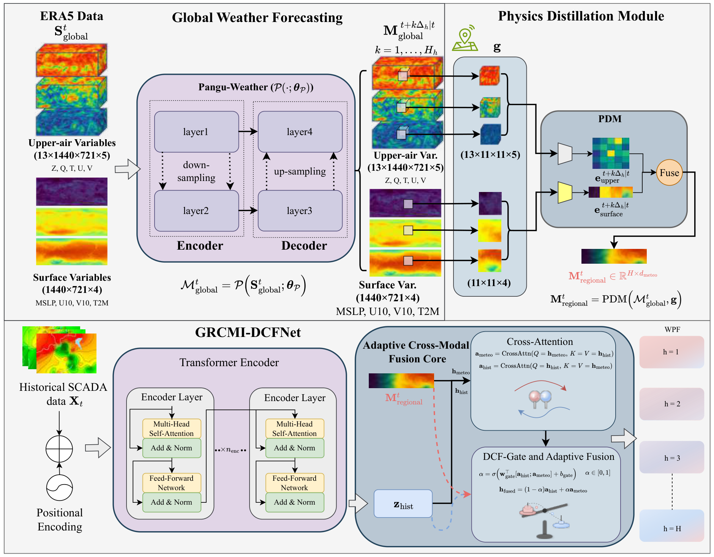
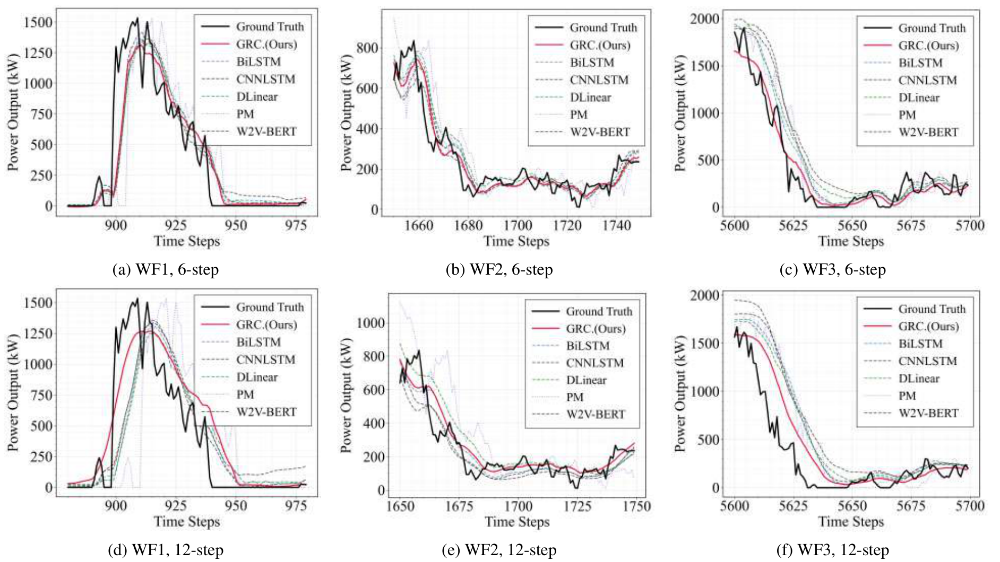

<div align="center">

# GRCMI-WPF

### A Cross-Scale Meteorological-Prior-Informed Adaptive Fusion Framework for Ultra-Short-Term Wind Power Forecasting

**Official repository · Accepted by Engineering Applications of Artificial Intelligence (EAAI)**

*Bridging global weather forecasts and local wind-power dynamics through adaptive cross-modal fusion.*

[Code](pangu_submitcode/) · [Overview](#overview) · [Main results](#main-results) · [Installation](#installation) · [Pangu-Weather](#download-pangu-weather) · [Data preparation](#data-preparation) · [Training](#train-grcmi-wpf)

</div>

## Overview

**GRCMI-WPF**—Global-Regional Cross-scale Meteorological Integration for Wind Power Forecasting—combines future-valid atmospheric context from a frozen Pangu-Weather model with historical wind-farm SCADA observations. Rather than simply appending weather variables, it learns how to localize, align, and adaptively fuse the two information sources.

- **Physics Distillation Module (PDM):** localizes global forecasts into an **11 × 11** regional patch, compresses upper-air and surface information, and aligns hourly meteorological features with the ten-minute prediction grid.
- **Hierarchical Cross-modal Alignment Transformer (HCAT):** aligns heterogeneous historical-SCADA and meteorological-prior representations.
- **Dynamic Context-dependent Fusion Gate (DCF-Gate):** learns sample-dependent weights for the two pathways within **DCFNet**, the Dynamic Context-dependent Fusion Network.

<p align="center">
  
</p>
<p align="center"><em>Framework overview, reproduced from Figure 1 of the paper.</em></p>

| Historical input | Forecast output | Meteorological context | Main evaluation |
| :---: | :---: | :---: | :---: |
| 36 ten-minute steps | 12 ten-minute steps | 69 channels; 11 × 11 regional grid | 5 wind-farm datasets; 13 reference methods |
| Nominal 6-hour history | 2-hour horizon | Two hourly anchors for the 2-hour task | Three random seeds |

**Pangu-Weather is not retrained or fine-tuned.** Training updates the downstream PDM, SCADA encoder, cross-modal fusion modules, and prediction head. “Physics distillation” denotes learned processing of meteorological fields; it does not impose physical-equation residuals on the forecasting loss.

## Main results

The following results are from **Table 2 of the paper**, under the within-site chronological benchmark: a 60%/20%/20% train/validation/test split, training-set normalization, a 36-step input window, and a 12-step output horizon. Entries are the reported three-seed means.

**GRCMI-WPF achieves the lowest MSE on all five datasets.** Its five-dataset average MSE is **0.3111**, approximately **8.5% lower** than the strongest reference method by average MSE, Wind2VecBERT (**0.3399**).

### MSE comparison

Lower is better. Values follow the paper's normalized evaluation convention.

| Method | WF1 | WF2 | WF3 | Eolos | Kelmarsh | Average |
| :--- | ---: | ---: | ---: | ---: | ---: | ---: |
| DLinear | 0.2121 | 0.2257 | 0.3191 | 0.6476 | 0.3444 | 0.3498 |
| PatchTST | 0.2177 | 0.2362 | 0.2938 | 0.6796 | 0.3498 | 0.3554 |
| BiLSTM | 0.2010 | 0.2158 | 0.3140 | 0.6431 | 0.3329 | 0.3414 |
| CNN-LSTM | 0.2081 | 0.2208 | 0.3283 | 0.6574 | 0.3357 | 0.3501 |
| GRU | 0.1943 | 0.2042 | 0.3114 | 0.7076 | 0.3303 | 0.3496 |
| Persistence | 0.2240 | 0.2390 | 0.3424 | 0.7246 | 0.3775 | 0.3815 |
| iTransformer | 0.2185 | 0.2335 | 0.3255 | 0.6783 | 0.3515 | 0.3614 |
| TimeMixer | 0.2140 | 0.2203 | 0.3261 | 0.6877 | 0.3480 | 0.3592 |
| TimesNet | 0.2200 | 0.2260 | 0.3359 | 0.6697 | 0.3532 | 0.3610 |
| QT-MARF | 0.1978 | 0.2114 | 0.3180 | 0.6900 | 0.3254 | 0.3485 |
| Wind2VecBERT | 0.1995 | 0.2151 | 0.3215 | 0.6388 | 0.3245 | 0.3399 |
| Chronos-2 (zero-shot) | 0.2844 | 0.2807 | 0.3693 | 0.7303 | 0.4081 | 0.4146 |
| TimesFM 2.5 (zero-shot) | 0.2755 | 0.3002 | 0.3720 | 0.7421 | 0.4121 | 0.4204 |
| **GRCMI-WPF (ours)** | **0.1908** | **0.2024** | **0.2904** | **0.5822** | **0.2898** | **0.3111** |

Across the five datasets, GRCMI-WPF also obtains the best reported average on the other five main metrics:

| MSE ↓ | RMSE ↓ | MAE ↓ | SDE ↓ | MAPE₁₀₀ (%) ↓ | R² ↑ |
| ---: | ---: | ---: | ---: | ---: | ---: |
| **0.3111** | **0.5445** | **0.3561** | **0.5433** | **36.5895** | **0.7937** |

MAPE₁₀₀ is computed in the original power domain on observations with true power ≥ 100 kW. The other metrics use the complete test set. Chronos-2 and TimesFM 2.5 are historical-target-only, zero-shot references.

<p align="center">
  
</p>
<p align="center"><em>Representative forecasting comparisons from Figure 3 of the paper. The original figure labels the proposed method as GRC (Ours).</em></p>

## Installation

### 1. Clone the repository

The released source code is already available under `pangu_submitcode/`. Clone this repository, then run the following commands from the repository root:

```bash
git clone https://github.com/IkeYang/GRCMI-WPF.git
cd GRCMI-WPF
```

**All commands below run from the repository root**, unless explicitly stated otherwise. Paths into `pangu_submitcode/` refer to the source tree included in this repository.

### 2. Set up the environment

The paper reports PyTorch 2.4.0 / CUDA 12.1. The following Linux setup uses Python 3.10 and the corresponding [official PyTorch wheel](https://pytorch.org/get-started/previous-versions/#v240):

```bash
conda create -n grcmi-wpf python=3.10 -y
conda activate grcmi-wpf

python -m pip install --upgrade pip
python -m pip install torch==2.4.0 --index-url https://download.pytorch.org/whl/cu121
python -m pip install "numpy<2" "pandas<3" scikit-learn netCDF4 onnx "cdsapi>=0.7.7"
python -m pip install onnxruntime==1.20.1
```

This installs **CPU ONNX inference for Pangu-Weather** and **CUDA PyTorch for downstream training**. They are separate stages: running Pangu on the CPU does not make the bundled training entry point CPU-compatible. `train_grcmi_wpf.py` requires an NVIDIA GPU visible to PyTorch and does not provide a CPU fallback.

```bash
python -c "import torch; print('PyTorch:', torch.__version__); print('CUDA available:', torch.cuda.is_available())"
```

<details>
<summary><strong>Optional: GPU inference for Pangu-Weather</strong></summary>

Use only one ONNX Runtime package in an environment. For the CUDA 12.x / cuDNN 9 stack, ONNX Runtime 1.20.x is listed as compatible with PyTorch 2.4.0 or later in the [official CUDA compatibility documentation](https://onnxruntime.ai/docs/execution-providers/CUDA-ExecutionProvider.html).

```bash
python -m pip uninstall -y onnxruntime onnxruntime-gpu
python -m pip install onnxruntime-gpu==1.20.1
python -c "import torch; import onnxruntime as ort; print(ort.get_available_providers())"
```

Import `torch` before creating an ONNX session, and select `CUDAExecutionProvider` in the inference example. Confirm that the session actually uses CUDA; driver, device, and runtime compatibility still need to be satisfied on the local machine.

The released `pangu_submitcode/requirements.txt` contains legacy ONNX pins and both CPU/GPU package names, and omits several downstream training dependencies. The explicit installation commands above avoid relying on that file unchanged.

</details>

## Download Pangu-Weather

Download the pretrained ONNX weights from the **[official Pangu-Weather repository](https://github.com/198808xc/Pangu-Weather#downloading-trained-models)**. Each model is approximately 1.1 GB.

| Lead time | Required filename | Google Drive | Baidu Netdisk | Extraction code |
| :---: | :--- | :---: | :---: | :---: |
| 1 hour | `pangu_weather_1.onnx` | [Download](https://drive.google.com/file/d/1fg5jkiN_5dHzKb-5H9Aw4MOmfILmeY-S/view?usp=share_link) | [Download](https://pan.baidu.com/s/1M7SAigVsCSH8hpw6DE8TDQ?pwd=ie0h) | `ie0h` |
| 3 hours | `pangu_weather_3.onnx` | [Download](https://drive.google.com/file/d/1EdoLlAXqE9iZLt9Ej9i-JW9LTJ9Jtewt/view?usp=share_link) | [Download](https://pan.baidu.com/s/197fZsoiCqZYzKwM7tyRrfg?pwd=gmcl) | `gmcl` |
| 6 hours | `pangu_weather_6.onnx` | [Download](https://drive.google.com/file/d/1a4XTktkZa5GCtjQxDJb_fNaqTAUiEJu4/view?usp=share_link) | [Download](https://pan.baidu.com/s/1q7IB7tNjqIwoGC7KVMPn4w?pwd=vxq3) | `vxq3` |
| 24 hours | `pangu_weather_24.onnx` | [Download](https://drive.google.com/file/d/1lweQlxcn9fG0zKNW8ne1Khr9ehRTI6HP/view?usp=share_link) | [Download](https://pan.baidu.com/s/179q2gkz2BrsOR6g3yfTVQg?pwd=eajy) | `eajy` |

Place the files under **`pangu_submitcode/models/`**. Keep the existing Python model files in that directory.

```text
pangu_submitcode/models/
├── GRCMI_WPF.py
├── pangu_weather_1.onnx
├── pangu_weather_3.onnx
├── pangu_weather_6.onnx
└── pangu_weather_24.onnx
```

The four-hour regional-cache workflow below uses the **1-hour and 3-hour** models. The 6-hour and 24-hour models support longer forecast rollouts.

**Upstream license:** Pangu-Weather weights are distributed under **CC BY-NC-SA 4.0**; the upstream repository prohibits commercial use. These terms concern the upstream weights and must not be interpreted as a license declaration for every file in this repository.

## Data preparation

### What is included

`pangu_submitcode/` contains model code, data loaders, ERA5/inference examples, a manual weather-cache packer, and training configurations. **It does not contain SCADA datasets, ERA5 fields, ONNX weights, processed weather caches, or trained downstream checkpoints.**

The local workflow is:

```text
ERA5 global fields → frozen Pangu-Weather inference → regional 11 × 11 crops
                                                     ↓
SCADA cleaning and synchronization → aligned regional caches → GRCMI-WPF training
```

Already have the processed SCADA file and aligned regional caches? Proceed directly to [training](#train-grcmi-wpf). Pangu weights are needed to generate weather caches, not to train the downstream network from existing caches.

### 1. Download ERA5 initial fields

Use the Copernicus Climate Data Store:

| Dataset | Variables to request |
| :--- | :--- |
| [ERA5 hourly single-level data](https://cds.climate.copernicus.eu/datasets/reanalysis-era5-single-levels) | Mean sea-level pressure; 10 m U/V wind components; 2 m temperature |
| [ERA5 hourly pressure-level data](https://cds.climate.copernicus.eu/datasets/reanalysis-era5-pressure-levels) | Geopotential; specific humidity; temperature; U/V wind components |

Register a CDS account, accept the terms of **both** datasets, and follow the [CDS API setup instructions](https://cds.climate.copernicus.eu/how-to-api). Store credentials in `~/.cdsapirc`, not in the repository:

```yaml
url: https://cds.climate.copernicus.eu/api
key: <YOUR-PERSONAL-ACCESS-TOKEN>
```

Request the **same UTC initial time** for both datasets, global coverage, and a **0.25° grid**. Use the dataset download page's **“Show API request code”** for the current request format. For pressure levels, select:

```text
1000, 925, 850, 700, 600, 500, 400, 300, 250, 200, 150, 100, 50 hPa
```

The released `pangu_submitcode/data_prepare.py` illustrates downloading one initial field and converting NetCDF variables to NumPy; `data_prepare_loop.py` illustrates repeated downloads. These are legacy examples with dates embedded in the scripts, not date-configurable command-line tools. Their request syntax and returned NetCDF coordinates must be checked against the current CDS response before reuse. When reusing these legacy helpers, run them with `pangu_submitcode/` as the working directory because their `forecasts/`, `models/`, and `results/` paths are relative to that directory; keep their initial dates consistent.

### 2. Convert ERA5 to the Pangu input format

Read the downloaded NetCDF variables with `netCDF4`, select one UTC time, reorder the coordinate axes explicitly, stack the variables in the order below, and save with `numpy.save`:

| File | Shape | Variable order |
| :--- | :--- | :--- |
| `input_surface.npy` | `(4, 721, 1440)` | **MSLP, U10, V10, T2M** |
| `input_upper.npy` | `(5, 13, 721, 1440)` | **Z, Q, T, U, V** |

Use **`float32`**, pressure levels in the descending order above, latitude from **90° to −90°**, and longitude from **0° to 359.75°**. Inspect the actual NetCDF coordinates: specifying a pressure-level order in a download request does not itself verify the returned array order.

Keep ERA5's original physical units and **do not z-score the global Pangu inputs**. In particular, **Z is geopotential, not geopotential height**. The downstream loader applies its own training-set normalization later.

For example, an initial time of 2017-01-01 00:00 UTC uses:

```text
pangu_submitcode/forecasts/
└── 2017-01-01-00-00/
    ├── input_upper.npy
    └── input_surface.npy
```

<details>
<summary><strong>Minimal global inference example: 24 → 6 → 3 → 1 hours</strong></summary>

This self-contained README example can be executed from the repository root without editing `pangu_submitcode/inference.py`. It requires prepared inputs and downloaded weights. Change `initial_time` and `lead_hours` to match the data.

```python
from datetime import datetime, timedelta
from pathlib import Path

import numpy as np
import onnxruntime as ort

root = Path("pangu_submitcode")
initial_time = datetime(2017, 1, 1, 0)  # UTC
lead_hours = 34
if not isinstance(lead_hours, int) or lead_hours <= 0:
    raise ValueError("lead_hours must be a positive integer")

input_dir = root / "forecasts" / initial_time.strftime("%Y-%m-%d-%H-%M")
output_dir = root / "results" / (
    f"{initial_time:%Y-%m-%d-%H-%M}to"
    f"{initial_time + timedelta(hours=lead_hours):%Y-%m-%d-%H-%M}"
)
output_dir.mkdir(parents=True, exist_ok=True)

upper = np.load(input_dir / "input_upper.npy", allow_pickle=False).astype(np.float32)
surface = np.load(input_dir / "input_surface.npy", allow_pickle=False).astype(np.float32)
if upper.shape != (5, 13, 721, 1440) or surface.shape != (4, 721, 1440):
    raise ValueError("Unexpected Pangu input shape")
if not np.isfinite(upper).all() or not np.isfinite(surface).all():
    raise ValueError("Pangu inputs must contain only finite values")

options = ort.SessionOptions()
options.enable_cpu_mem_arena = False
options.enable_mem_pattern = False
options.enable_mem_reuse = False
options.intra_op_num_threads = 1

remaining, current_time = lead_hours, initial_time
for hours in (24, 6, 3, 1):
    if remaining < hours:
        continue
    model_file = root / "models" / f"pangu_weather_{hours}.onnx"
    if not model_file.is_file():
        raise FileNotFoundError(model_file)
    session = ort.InferenceSession(
        str(model_file), sess_options=options,
        providers=["CPUExecutionProvider"],
    )
    while remaining >= hours:
        upper, surface = session.run(
            None, {"input": upper, "input_surface": surface}
        )
        remaining -= hours
        current_time += timedelta(hours=hours)
        stamp = current_time.strftime("%Y-%m-%d-%H-%M")
        np.save(output_dir / f"output_upper_{stamp}.npy", upper)
        np.save(output_dir / f"output_surface_{stamp}.npy", surface)
    del session
```

For `lead_hours=34`, this saves **T+24, T+30, T+33, and T+34**, not every intervening hourly field. Output layout and units match the inputs. For GPU inference, import `torch` first and use the CUDA provider after setting up a compatible environment.

The released `pangu_submitcode/inference.py` implements a similar greedy rollout but has its own hard-coded dates. `forecast_decode.py` exports selected forecasts to NetCDF; that export is not required by the NumPy-based training loader.

</details>

### 3. Generate regional weather tensors

For the four-anchor cache format used by `pdm_manual_pack.py`, generate forecasts at **T+1, T+2, T+3, and T+4 hours from the same initial field**:

```text
Initial global field → 1 h model → T+1 → 1 h model → T+2
Initial global field → 3 h model → T+3 → 1 h model → T+4
```

The T+3 branch restarts from the initial field. A greedy four-hour rollout alone produces only T+3 and T+4 and is therefore **not** a replacement for this four-anchor workflow.

Run Pangu on the **full global grid**, then crop an **11 × 11** neighborhood around the target farm from each forecast. Retain all five upper-air variables at all thirteen levels and all four surface variables. The global NumPy tensors are channel-first; regional cache tensors retain that ordering rather than the schematic axis ordering in the architecture figure.

For a site with latitude `lat` and longitude `lon`, the nearest-grid crop follows:

```python
# upper_global: (5, 13, 721, 1440); surface_global: (4, 721, 1440)
# lat and lon must be the target site's actual coordinates in degrees.
i_lat = int(np.rint((90.0 - lat) / 0.25))
i_lon = int(np.rint((lon % 360.0) / 0.25)) % 1440
if not 5 <= i_lat <= 715:
    raise ValueError("An 11x11 centered crop requires explicit polar handling here")
lon_idx = (np.arange(i_lon - 5, i_lon + 6) % 1440)
upper_patch = np.take(upper_global[:, :, i_lat-5:i_lat+6, :], lon_idx, axis=-1)
surface_patch = np.take(surface_global[:, i_lat-5:i_lat+6, :], lon_idx, axis=-1)
# Shapes: (5, 13, 11, 11) and (4, 11, 11).
```

Repeat for the necessary issue times, and build a site-specific, **SCADA-aligned** cache with the following shapes:

| Array | Shape | Meaning |
| :--- | :--- | :--- |
| `upper_raw.npy` | `(N, 4, 5, 13, 11, 11)` | Aligned rows × four forecast anchors × variables × pressure levels × regional grid |
| `surface_raw.npy` | `(N, 4, 4, 11, 11)` | Aligned rows × four forecast anchors × surface variables × regional grid |
| `time_labels.npy` | `(N,)` | Row timestamps / alignment labels |

Here **N is the number of aligned SCADA rows**, not simply the number of hourly ERA5 downloads. For the 12-step task, the loader selects the first two hourly anchors (`prediction_horizon // 6`). The learned PDM performs feature compression and temporal alignment inside the trainable model; no learned PDM preprocessing is required before training.

ERA5 is used here for retrospective initial fields. Do not substitute future ERA5 observations for forecast-issued priors; real-time deployment also requires initial fields that are actually available at the intended issue time.

### 4. Prepare SCADA data

Use chronologically sorted, synchronized ten-minute records. The SCADA pickle must contain a dictionary with these fields:

```python
{
    "data": scada_array,           # float32, shape (N, number_of_turbines, F)
    "timestamps": timestamps,      # length N, chronological UTC timestamps
    "turbine_ids": turbine_ids,    # length number_of_turbines
    "feature_names": feature_names # length F, in the same order as data's last axis
}
```

Store physical, unstandardized feature values. Resolve missing or invalid records consistently across modalities before packing; raw-data cleaning is site-specific and is not implemented by the bundled training command. Check for finite values and nonzero training-set standard deviations: the released normalizer divides by the training standard deviation without a zero-variance guard.

### 5. Pack the regional caches

After producing `upper_raw.npy`, `surface_raw.npy`, and `time_labels.npy` in a local `prepared/` directory, run:

```bash
mkdir -p data/processed

python pangu_submitcode/pdm_manual_pack.py \
  --dataset_tag YOUR_DATASET_TAG \
  --upper_raw prepared/upper_raw.npy \
  --surface_raw prepared/surface_raw.npy \
  --time_labels prepared/time_labels.npy \
  --output_dir data/processed
```

The packer wraps the existing tensors as NumPy dictionaries containing `data` and `time_labels`. It **does not** download ERA5, run Pangu, crop spatial fields, or synchronize timestamps.

Place the matching SCADA pickle and packed weather arrays in `data/processed/`. Only load pickle files or pickled NumPy dictionaries from trusted sources.

## Train GRCMI-WPF

### 1. Create a local run configuration

The released JSON files contain the original machine's absolute data path. Create a **separate local configuration** instead of modifying the released files:

```bash
python - <<'PY'
import json
from pathlib import Path

root = Path.cwd()
template = root / "pangu_submitcode/config/configGRCMI_WPF_submit.json"
config = json.loads(template.read_text(encoding="utf-8"))
config["data_root"] = str((root / "data/processed").resolve())
config["deviceNum"] = 0
config["turbine_indices"] = [0]
(root / "run_config.json").write_text(
    json.dumps(config, indent=2), encoding="utf-8"
)
print("Created", root / "run_config.json")
PY
```

### 2. Launch training

```bash
python pangu_submitcode/train_grcmi_wpf.py \
  --config run_config.json \
  --output_root experiments
```

The entry point loads SCADA and weather caches, applies chronological splitting and training-set normalization, and trains the downstream network with **Adam and MSE loss**. Run individual turbine configurations separately for turbine-level experiments.

Create the local configuration from the matching template and ensure that `dataset_name`, `data_root`, and cache filenames agree. Dataset and training options are read from JSON; the launcher accepts `--config` and `--output_root`, not separate `--dataset` or `--epochs` options.

### 3. Find the outputs

```text
experiments/
└── GRCMI-WPF_<dataset_name>_WT0_seq36_pred12_<timestamp>/
    ├── best_model.pth
    ├── config_snapshot.json
    ├── all_epochs_metrics.csv
    ├── best_epoch_test_results.csv
    └── train.log
```

`best_model.pth` contains model weights. Keep the corresponding configuration, feature order, data alignment, and training-set normalization statistics for subsequent inference; the weight file alone is not a complete preprocessing pipeline.

## Citation and acknowledgements

Please cite our paper when using this implementation:

> **A Cross-Scale Meteorological-Prior-Informed Adaptive Fusion Framework for Ultra-Short-Term Wind Power Forecasting.** Engineering Applications of Artificial Intelligence, accepted for publication.

We thank the [Pangu-Weather authors](https://github.com/198808xc/Pangu-Weather) for releasing their pretrained models and ECMWF / the Copernicus Climate Change Service for ERA5. Please also cite the upstream Pangu-Weather paper when using its pretrained forecasts:

> Bi, K., Xie, L., Zhang, H., Chen, X., Gu, X., and Tian, Q. **Accurate medium-range global weather forecasting with 3D neural networks.** Nature 619, 533–538 (2023). [Paper](https://www.nature.com/articles/s41586-023-06185-3).
